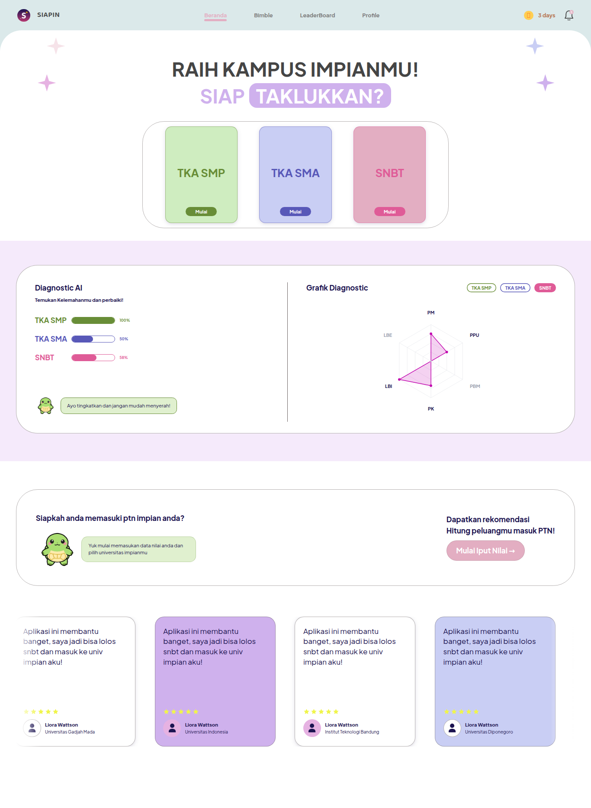
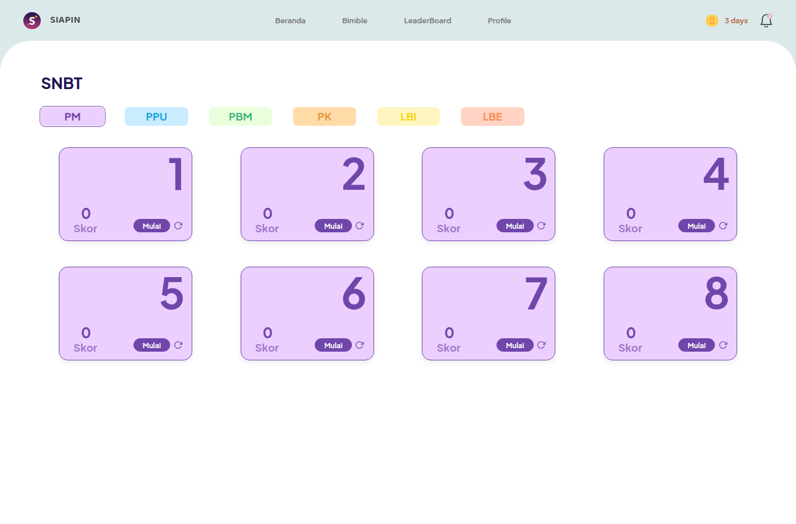
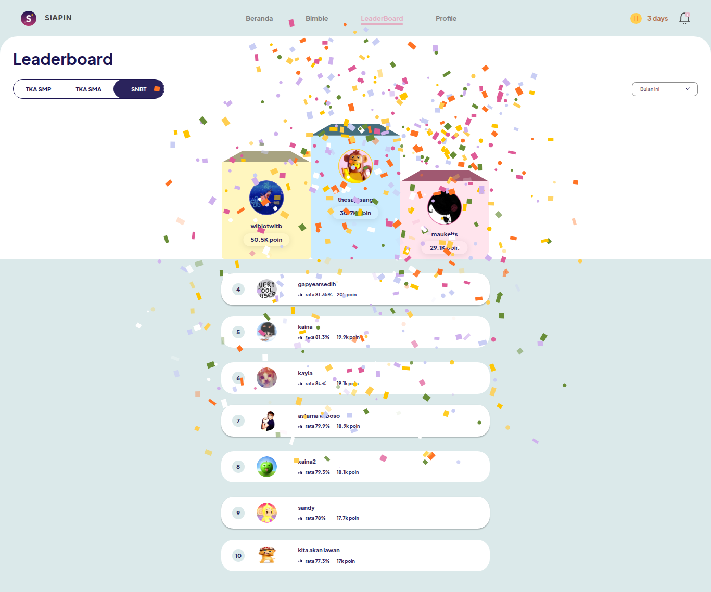
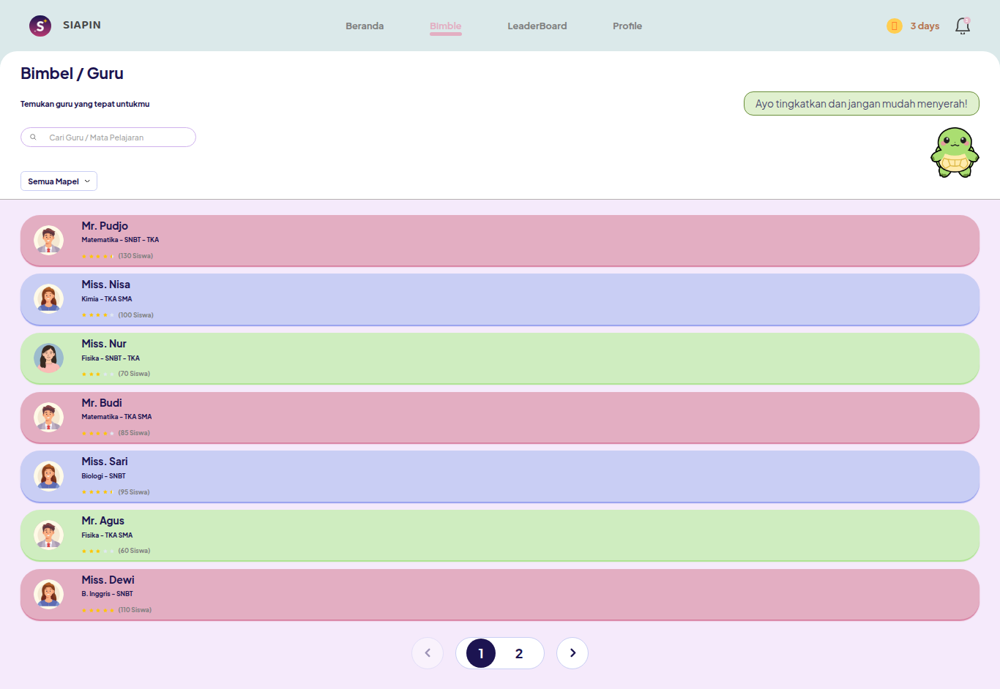
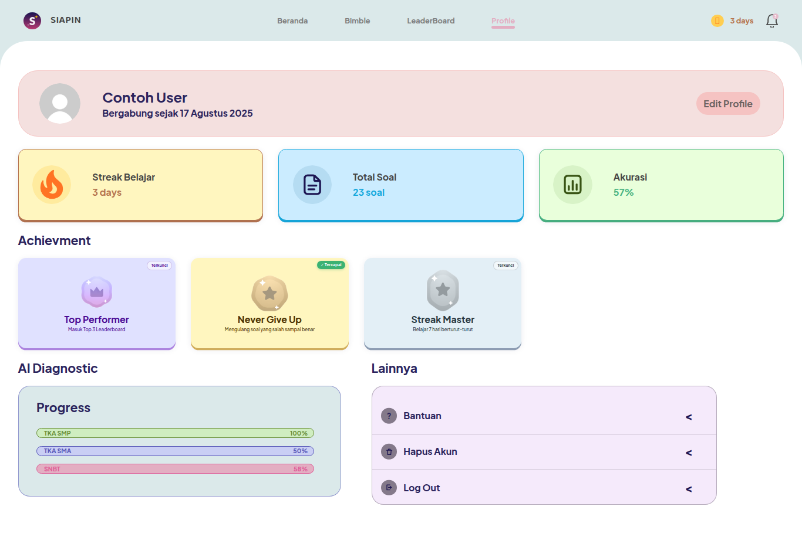

<div align="center">


# SIAPIN

**Siap Taklukkan PTN Impianmu**

Platform bimbel digital untuk persiapan SNBT, TKA SMA, dan TKA SMP. Drill soal, ukur kesiapan, lalu estimasi peluang masuk PTN impian.

<br/>


**Team MW Menang - SCC · Lomba Inovasi Digital (Babak Penyisihan)**

| Nama | Peran |
|---|---|
| **Bagas Rizky Hary Saputra** | Programmer |
| **Amelia Galuh Widianingrum** | Desainer |
| **Theodora Ovrisa Ersalina** | Desain dan Conceptor |

**Website Live:** [https://siapin.work.gd](https://siapin.work.gd)

**Repositori:** [github.com/BagasRizkyHarySaputra/SIAPIN](https://github.com/BagasRizkyHarySaputra/SIAPIN)

</div>

---

## Daftar Isi

1. [Preview](#preview)
2. [Ketentuan Pengumpulan Karya (Babak Penyisihan)](#ketentuan-pengumpulan-karya-babak-penyisihan)
3. [Penjelasan Aplikasi](#penjelasan-aplikasi)
4. [Teknologi yang Digunakan](#teknologi-yang-digunakan)
5. [Fitur Utama](#fitur-utama)
6. [Filosofi dan Arsitektur](#filosofi-dan-arsitektur)
7. [Cara Instalasi](#cara-instalasi)
8. [Cara Penggunaan](#cara-penggunaan)
9. [Struktur Proyek](#struktur-proyek)
10. [Sumber Data dan Kredit](#sumber-data-dan-kredit)

---

## Preview

Berikut tampilan asli aplikasi yang sudah berjalan (diakses dari browser desktop dan HP).

<details open>
<summary><b>Halaman Dashboard</b></summary>

Dashboard menampilkan hero, pilihan mode ujian (SNBT, TKA SMA, TKA SMP), hasil Diagnostic AI, dan grafik perkembangan.



</details>

<details>
<summary><b>Halaman Soal / Latihan</b></summary>

Bank soal 2.158 butir dengan navigasi per mode, subtes, dan paket. Setelah menjawab, siswa langsung mendapat koreksi dan pembahasan.



</details>

<details>
<summary><b>Halaman Leaderboard</b></summary>

Papan peringkat real-time dengan podium juara 1, 2, 3 dan animasi confetti saat halaman terbuka.



</details>

<details>
<summary><b>Halaman Bimble</b></summary>

Halaman bimbingan belajar berisi 14 guru/mentor untuk TKA SMP, TKA SMA, dan SNBT.



</details>

<details>
<summary><b>Halaman Profile</b></summary>

Ringkasan akun: akurasi, total soal, streak harian, achievement, dan riwayat belajar.



</details>

---

## Ketentuan Pengumpulan Karya (Babak Penyisihan)

Karya dikumpulkan sesuai ketentuan lomba **"Smart Sustainable Digital Solution for Inclusive Society"**, yaitu solusi digital berbasis web yang inovatif, responsif, dan aplikatif.

<details>
<summary><b>1. Tautan Repositori GitHub</b></summary>

Repositori ini berisi seluruh kode program aplikasi serta dokumen `README.md` yang mencakup ketentuan pengumpulan karya, penjelasan aplikasi, teknologi yang digunakan, fitur utama, cara instalasi, dan cara penggunaan. Seluruh perubahan kode tercatat melalui git commit agar riwayat pengembangan jelas dan transparan.

Tautan repositori: [github.com/BagasRizkyHarySaputra/SIAPIN](https://github.com/BagasRizkyHarySaputra/SIAPIN)

</details>

<details>
<summary><b>2. Tautan Hasil Karya yang Sudah di-Hosting</b></summary>

Aplikasi di-deploy ke hosting produksi (VPS + Nginx + HTTPS) sehingga dapat diakses publik secara nyata.

Tautan website: [https://siapin.work.gd](https://siapin.work.gd)

</details>

<details>
<summary><b>3. Kesesuaian dengan Subtema Lomba</b></summary>

Subtema berfokus pada pengembangan solusi digital berbasis web yang inovatif, responsif, dan aplikatif untuk masa depan yang inklusif, berkelanjutan, dan siap menghadapi transformasi era digital. SIAPIN mendukung implementasi SDG berikut.

| SDG | Kontribusi SIAPIN |
|---|---|
| **SDG 4, Pendidikan Berkualitas** (tema utama) | Menyediakan akses latihan soal dan bimbingan setara bimbel secara gratis dan terjangkau lewat web, sehingga siswa di daerah tanpa akses bimbel fisik tetap bisa mempersiapkan SNBT/PTN. |
| **SDG 8, Pekerjaan Layak dan Pertumbuhan Ekonomi** | Membantu siswa lolos PTN sehingga terbuka peluang pendidikan tinggi dan karier yang lebih baik. |
| **SDG 9, Industri, Inovasi dan Infrastruktur** | Dibangun di atas teknologi web modern (Next.js, React, TypeScript, Tailwind, Prisma) dengan arsitektur efisien dan mudah di-deploy, sebagai contoh nyata inovasi berbasis web. |
| **SDG 11, Kota dan Komunitas Berkelanjutan** | Solusi ringan dan ramah sumber daya (SQLite file tunggal, tanpa server database mahal) yang dapat dijalankan di perangkat minim, mendukung layanan publik pendidikan yang inklusif. |

Inklusif: cukup browser dan internet, tanpa biaya bimbel mahal.
Berkelanjutan: arsitektur ringan, data lokal, mudah dirawat dan dicadangkan.
Siap transformasi digital: pengalaman belajar modern, gamifikasi, dan berbasis data.

</details>

---

## Penjelasan Aplikasi

### Latar Belakang

Setiap tahun ratusan ribu siswa bersaing memperebutkan kursi di Perguruan Tinggi Negeri (PTN) melalui jalur SNBT. Tidak semua siswa memiliki akses yang sama.

* Biaya bimbel konvensional mahal dan tidak terjangkau sebagian besar keluarga.
* Materi dan latihan soal berkualitas tersebar dan sulit ditemukan dalam satu tempat.
* Banyak siswa tidak tahu seberapa besar peluangnya diterima di PTN atau prodi impian sebelum mendaftar.
* Belum ada umpan balik yang jelas tentang kelemahan dan progres belajar.

Dari situlah SIAPIN lahir, sebuah platform bimbel digital yang ingin menghapus hambatan biaya dan akses menuju pendidikan tinggi.

### Tujuan

1. Menyediakan bank soal orisinal dan gratis untuk SNBT, TKA SMA, dan TKA SMP dengan format yang menyerupai ujian sebenarnya.
2. Memberikan diagnostik dan estimasi peluang masuk PTN berbasis data agar siswa bisa memilih kampus dan prodi secara cerdas dan realistis.
3. Membangun kebiasaan belajar melalui gamifikasi (streak, achievement, leaderboard).
4. Menjadi solusi web yang responsif (HP, tablet, desktop), inklusif, ringan, dan berkelanjutan.

---

## Teknologi yang Digunakan

### Framework dan Bahasa

| Teknologi | Versi | Kegunaan |
|---|---|---|
| **Next.js** | 16.3.4 | Framework React full-stack (App Router, SSR, API Routes) |
| **React** | 19.2.8 | Library UI berbasis komponen |
| **TypeScript** | ^5 | Bahasa dengan type safety agar kode lebih andal |
| **Tailwind CSS** | v4 | Utility-first CSS untuk desain cepat dan konsisten |
| **Prisma ORM** | 7.10.0 | ORM modern untuk akses database yang aman dan terstruktur |
| **better-sqlite3** | 13.0.3 | Database SQLite file tunggal, tanpa server terpisah |
| **Auth.js (NextAuth v5)** | ^5.0.0-beta | Autentikasi email dan OAuth Google dengan sesi JWT |
| **bcryptjs** | 3.0.3 | Hash password |

### Library Pendukung

| Library | Kegunaan |
|---|---|
| `@prisma/adapter-better-sqlite3` | Menghubungkan Prisma ke SQLite |
| `tsx` | Menjalankan script TypeScript (seed, backup) |
| `next/font/google` | Font Plus Jakarta Sans dan Baloo 2 |
| `dotenv` | Membaca file `.env` |
| Brevo API (REST) | Email transaksional untuk verifikasi email dan reset password |

### Alasan Pemilihan Teknologi

* **Next.js + App Router.** Satu codebase untuk frontend dan backend (API route). Ringkas, cepat (SSR), dan mudah di-deploy.
* **TypeScript.** Mengurangi bug dan memudahkan kolaborasi tim karena kode lebih terdokumentasi.
* **SQLite + Prisma.** Tanpa server database terpisah. Cukup satu file, portabel, dan mudah di-backup. Cocok untuk solusi berkelanjutan yang mudah diset-up siapa pun.
* **Auth.js.** Standar industri untuk autentikasi, mendukung banyak provider (termasuk Google OAuth) dengan aman.
* **Tailwind v4 + CSS Variables.** Sistem desain berwarna khas SIAPIN (indigo, lime, blush, lavender) yang konsisten dan ringan.

---

## Fitur Utama

Hal yang menjadi pembeda sekaligus keunggulan SIAPIN dibanding aplikasi lain.

<details open>
<summary><b>1. Bank Soal Orisinal 2.158 Butir dalam 3 Mode Ujian</b></summary>

| Mode | Subtes / Mapel | Jumlah |
|---|---|---|
| **SNBT** | Penalaran Matematika, PPU, PBM, Pengetahuan Kuantitatif, Literasi Bahasa Indonesia, Literasi Bahasa Inggris | 900 |
| **TKA SMA** | Matematika, Fisika, Kimia, Biologi, Ekonomi | 760 |
| **TKA SMP** | Matematika, IPA, Bahasa Inggris | 498 |
| | **Total** | **2.158** |

Seluruh soal ditulis orisinal mengikuti struktur resmi SNPMB SNBT dan Pusmendik. Setiap jawaban langsung dikoreksi dan diberi pembahasan.

</details>

<details>
<summary><b>2. Estimasi Peluang Masuk PTN (75 PTN, 3.825 Prodi)</b></summary>

Siswa memasukkan nilai lalu mendapat estimasi peluang diterima di PTN dan prodi impian. Perhitungan berbasis data daya tampung, peminat, rasio keketatan, dan passing grade estimasi dari SNPMB serta crowdsource. Aplikasi menampilkan logo resmi 74 PTN dan rekomendasi prodi yang realistis.

</details>

<details>
<summary><b>3. Diagnostic AI (Radar Kemampuan)</b></summary>

Setelah mengerjakan soal, SIAPIN menyusun diagnostik kemampuan per subtes dan menampilkannya dalam radar chart. Siswa langsung tahu materi mana yang kuat dan lemah sehingga belajarnya lebih terarah.

</details>

<details>
<summary><b>4. Gamifikasi: Leaderboard, Streak, dan Achievement</b></summary>

Tersedia leaderboard nasional real-time dengan podium juara 1, 2, 3 dan animasi confetti, streak harian untuk membangun kebiasaan belajar konsisten, serta achievement Top Performer, Never Give Up, dan Streak Master yang terbuka otomatis saat syarat tercapai.

</details>

<details>
<summary><b>5. Akun Modern: Google OAuth dan Verifikasi Email</b></summary>

Siswa bisa daftar dan login dengan email dan password (di-hash bcrypt) atau sekali klik melalui Google OAuth. Verifikasi email serta lupa password dan reset dikirim melalui email transaksional Brevo. Profil pribadi menampilkan akurasi, total soal, streak, riwayat, dan prestasi.

</details>

<details>
<summary><b>6. Bimble dan Mentor</b></summary>

Tersedia halaman bimbingan dengan 14 guru atau mentor untuk TKA SMP, TKA SMA, dan SNBT. Setiap guru memiliki panel materi khusus sehingga suasana bimbel sungguhan bisa dirasakan secara digital.

</details>

<details>
<summary><b>7. Super Responsif untuk HP, Tablet, dan Desktop</b></summary>

Tampilan dioptimalkan untuk orientasi portrait dan landscape di semua ukuran layar. Skala desain proporsional (`--pm`) membuat aplikasi nyaman dipakai di HP dengan layar kecil, dilengkapi transisi antar halaman yang halus.

</details>

<details>
<summary><b>8. Sistem Backup Otomatis Database</b></summary>

Database di-backup sebagai salinan file SQLite plus dump JSON ke folder `backups/`, baik manual maupun terjadwal. Setiap backup tercatat di tabel `BackupLog` sehingga data aman dan bisa direstorasi atau dipindahkan.

</details>

---

## Filosofi dan Arsitektur

> Mudah diset-up, ringan dijalankan, mudah dirawat. Supaya solusi ini benar-benar dipakai dan berkelanjutan.

### Kenapa Arsitekturnya Seperti Ini?

| Keputusan | Alasan |
|---|---|
| SQLite file tunggal, bukan PostgreSQL/MySQL | Tanpa server DB terpisah. Setup instan, portabel, hemat sumber daya, mudah di-backup, dan cukup andal untuk skala ribuan pengguna awal. |
| Bank soal sebagai file TypeScript statis | Soal cepat diakses tanpa query database, mudah direview, bisa di-versioning via git, dan tidak perlu migrasi setiap menambah soal. |
| Repository Pattern (`lib/repo`) | Memisahkan logika akses data dari UI sehingga kode bersih dan mudah dirawat. |
| Next.js App Router + API Routes | Frontend dan backend dalam satu proyek, deploy sederhana dalam satu proses `next start`. |
| Auth.js sesi JWT | Autentikasi aman tanpa tabel sesi tambahan dan mudah ditambah provider lain. |
| CSS Variables + Tailwind + skala `--pm` | Satu sumber warna dan skala sehingga desain konsisten, responsif, dan mudah diubah. |
| Data PTN terpisah (JSON + helper estimasi) | Dataset besar tidak membebani database dan estimasi menjadi pure function yang transparan serta bisa diaudit. |

### Alur Data Singkat

```text
User (HP/Desktop)
      |  HTTPS
      v
Nginx (siapin.work.gd) --> Next.js (App Router + API Routes) --> Prisma --> SQLite (file)
      |                              |
      |                              |--> Bank soal statis (lib/data), 2.158 soal
      |                              |--> Dataset PTN (lib/data/ptn), 75 PTN / 3.825 prodi
      |                              |--> Brevo API, email verifikasi dan reset
      |                              `--> lib/repo, repository akses data
```

---

## Cara Instalasi

### Prasyarat

* Node.js 20+ (disarankan 22.x LTS)
* npm 10+
* Opsional: akun Brevo untuk pengiriman email sungguhan. Bagian ini bisa dilewati karena tersedia mode simulasi.

### Langkah-langkah

<details open>
<summary><b>1. Clone repositori</b></summary>

```bash
git clone https://github.com/BagasRizkyHarySaputra/SIAPIN.git
cd SIAPIN
```

</details>

<details open>
<summary><b>2. Install dependensi</b></summary>

```bash
npm install
```

Apabila menemui masalah resolusi peer dependency di environment tertentu, gunakan `npm install --legacy-peer-deps`.

</details>

<details open>
<summary><b>3. Siapkan environment variable</b></summary>

Salin contoh file environment lalu isi nilainya.

```bash
cp .env.example .env
```

Isi minimal yang perlu diperhatikan (semua sudah tersedia di `.env.example`):

```env
# URL aplikasi
AUTH_URL=http://localhost:3000
AUTH_SECRET=<generate-acak-panjang>

# Database SQLite (file lokal)
DATABASE_URL="file:./prisma/dev.db"

# Opsional: Google OAuth (kosongkan untuk nonaktif)
GOOGLE_CLIENT_ID=
GOOGLE_CLIENT_SECRET=

# Opsional: email transaksional via Brevo (kosongkan = mode simulasi)
RESEND_API_KEY=
EMAIL_FROM="SIAPIN <email-pengirim@example.com>"
```

Generate secret dengan perintah `openssl rand -base64 32`.

Tanpa `GOOGLE_CLIENT_ID/SECRET`, tombol login Google otomatis disembunyikan. Tanpa `RESEND_API_KEY`, email verifikasi dan reset berjalan dalam mode simulasi, yaitu link ditampilkan di layar dan tidak dikirim.

</details>

<details open>
<summary><b>4. Siapkan database dan seed (opsional)</b></summary>

```bash
# Terapkan migrasi database SQLite
npx prisma migrate deploy

# Seed data awal + akun demo
npm run db:seed
```

Akun demo yang dibuat seed: `contoh@gmail.com` dengan password `contoh123`.

</details>

<details open>
<summary><b>5. Jalankan mode pengembangan</b></summary>

```bash
npm run dev
```

Buka http://localhost:3000

</details>

---

## Cara Penggunaan

### Menjalankan Aplikasi

```bash
# Mode pengembangan (hot reload)
npm run dev

# Mode produksi
npm run build
npm run start
```

Aplikasi berjalan di `http://localhost:3000` secara default.

### Alur Pakai Aplikasi

1. Buka http://localhost:3000, otomatis diarahkan ke halaman Dashboard.
2. Daftar atau login memakai akun demo `contoh@gmail.com` / `contoh123`, atau daftar baru dengan email dan password / Google.
3. Pilih mode ujian di dashboard: SNBT, TKA SMA, atau TKA SMP.
4. Kerjakan soal. Jawaban langsung dikoreksi dan diberi pembahasan.
5. Lihat Diagnostic AI / radar chart untuk mengetahui subtes yang perlu diperkuat.
6. Gunakan fitur input nilai / pilih PTN untuk melihat estimasi peluang masuk PTN impian.
7. Jaga streak harian, kumpulkan achievement, dan pantau posisi di leaderboard.

### Script dan Perintah Berguna

```bash
npm run dev            # Menjalankan development server
npm run build          # Build produksi (Next.js)
npm run start          # Menjalankan server produksi
npm run lint           # Cek kode dengan ESLint
npm run db:seed        # Seed database + akun demo
npm run db:backup      # Backup database ke folder backups
npm run db:studio      # Membuka Prisma Studio (GUI database)
npx prisma migrate deploy   # Menerapkan migrasi database
npx prisma migrate dev      # Membuat migrasi baru saat schema berubah
```

### Deploy Produksi (Contoh VPS + Nginx)

```bash
npm run build
nohup ./node_modules/.bin/next start -p 8080 >> /tmp/siapin.log 2>&1 &
```

Arahkan Nginx ke `127.0.0.1:8080` dan pasang sertifikat HTTPS (contoh: Let's Encrypt).

---

## Struktur Proyek

```text
siapin/
|-- app/                        # Next.js App Router (halaman dan API)
|   |-- page.tsx                # Landing, redirect ke /dashboard
|   |-- dashboard/page.tsx      # Dashboard utama
|   |-- soal/[slug]/...         # Halaman latihan soal (mode, subtes, paket)
|   |-- bimble/page.tsx         # Bimbingan belajar (guru/mentor)
|   |-- leaderboard/page.tsx    # Papan peringkat
|   |-- profile/page.tsx        # Profil dan pengaturan
|   `-- api/                    # API routes (auth, soal, diagnostik, dll.)
|-- components/
|   |-- layout/                 # Layout, transisi halaman, navbar
|   |-- ui/                     # Komponen UI dasar
|   `-- features/               # Komponen per fitur
|       |-- dashboard/  soal/  bimble/
|       |-- leaderboard/        # Podium, confetti, baris peringkat
|       `-- profile/            # Kartu akun, achievement, popup edit
|-- lib/
|   |-- repo/                   # Repository pattern (akses data)
|   |-- data/                   # Data statis: modes, bank soal, PTN, guru
|   |   |-- bank/banks/         # 2.158 soal orisinal (snbt, tka-sma, tka-smp)
|   |   `-- ptn/                # 75 PTN, 3.825 prodi, estimasi, logo
|   |-- store/                  # State (auth)
|   |-- auth.ts                 # Konfigurasi Auth.js
|   |-- mail.ts                 # Email transaksional (Brevo) dan token
|   |-- db.ts                   # Koneksi Prisma
|   |-- backup.ts               # Sistem backup database
|   `-- cq.ts                   # Utility container query dan skala responsif
|-- prisma/
|   |-- schema.prisma           # Skema database (User, Soal, Riwayat, dll.)
|   |-- migrations/             # Migrasi database
|   `-- seed.ts                 # Seed awal + akun demo
|-- public/
|   |-- visual/                 # Logo, maskot, aset visual
|   `-- logos/                  # Logo 74 PTN
|-- docs/
|   `-- screenshots/            # Tangkapan layar aplikasi (bagian Preview)
`-- package.json
```

### Model Data (Ringkas)

```text
User -- UserProfile          (profil: nama, no. HP, avatar)
  |-- AiDiagnostic            (hasil diagnostik per subtes)
  |-- InputNilai              (nilai untuk estimasi PTN)
  |-- RiwayatPengerjaan       (riwayat latihan)
  |     `-- JawabanUser       (jawaban detail)
  |-- Leaderboard             (skor per mode)
  `-- UserAchievement -- Achievement
Mapel -- PaketSoal -- Soal   (bank soal)
Guru                          (mentor/bimble)
BackupLog                     (log backup database)
```

---

## Sumber Data dan Kredit

<details>
<summary><b>Bank Soal 2.158 Butir Orisinal</b></summary>

Seluruh soal ditulis orisinal oleh tim dengan bantuan AI generatif sebagai draf awal, lalu diverifikasi kebenaran jawaban dan sintaksnya sebelum dipakai. Struktur materi mengacu pada:

* Struktur resmi SNBT dari SNPMB BPPP Kemdikbud: https://snpmb.bppp.kemdikbud.go.id
* Struktur TKA dari Pusmendik / Pusmenjar

</details>

<details>
<summary><b>Data PTN, Prodi, Daya Tampung, dan Passing Grade</b></summary>

| Data | Cakupan | Sumber |
|---|---|---|
| Daftar 75 PTN (kode, wilayah, tier, daya tampung, peminat) | 75 PTN | [TeguhEP/LolosKampus](https://github.com/TeguhEP/LolosKampus) |
| 3.825 prodi (daya tampung 2026, peminat, rasio keketatan, passing grade estimasi) | 75 PTN x 3.825 prodi | [TeguhEP/LolosKampus](https://github.com/TeguhEP/LolosKampus) |
| Data historis daya tampung dan peminat (2021-2025) | 543 prodi | [divarvian/daya-tampung](https://github.com/divarvian/daya-tampung) |

Sumber asli yang dirujuk adalah SNPMB SNBT 2021-2026 (data resmi) dan Schoolfess Community 2022-2025 (crowdsource nilai UTBK untuk rekonstruksi passing grade estimasi).

Catatan: passing grade adalah estimasi hasil rekonstruksi dari data crowdsource, bukan ambang resmi SNPMB.

Logo PTN diunduh dari Wikipedia Bahasa Indonesia / Wikimedia Commons untuk 74 dari 75 PTN. Sisanya memakai fallback inisial.

</details>

---

<div align="center">
  
  <br/><br/>
  <b>SIAPIN. Siap Taklukkan PTN Impianmu.</b><br/>
  Dibuat oleh Team MW Menang - SCC
  <br/><br/>
  <sub>2026 · https://siapin.work.gd · github.com/BagasRizkyHarySaputra/SIAPIN</sub>
</div>
