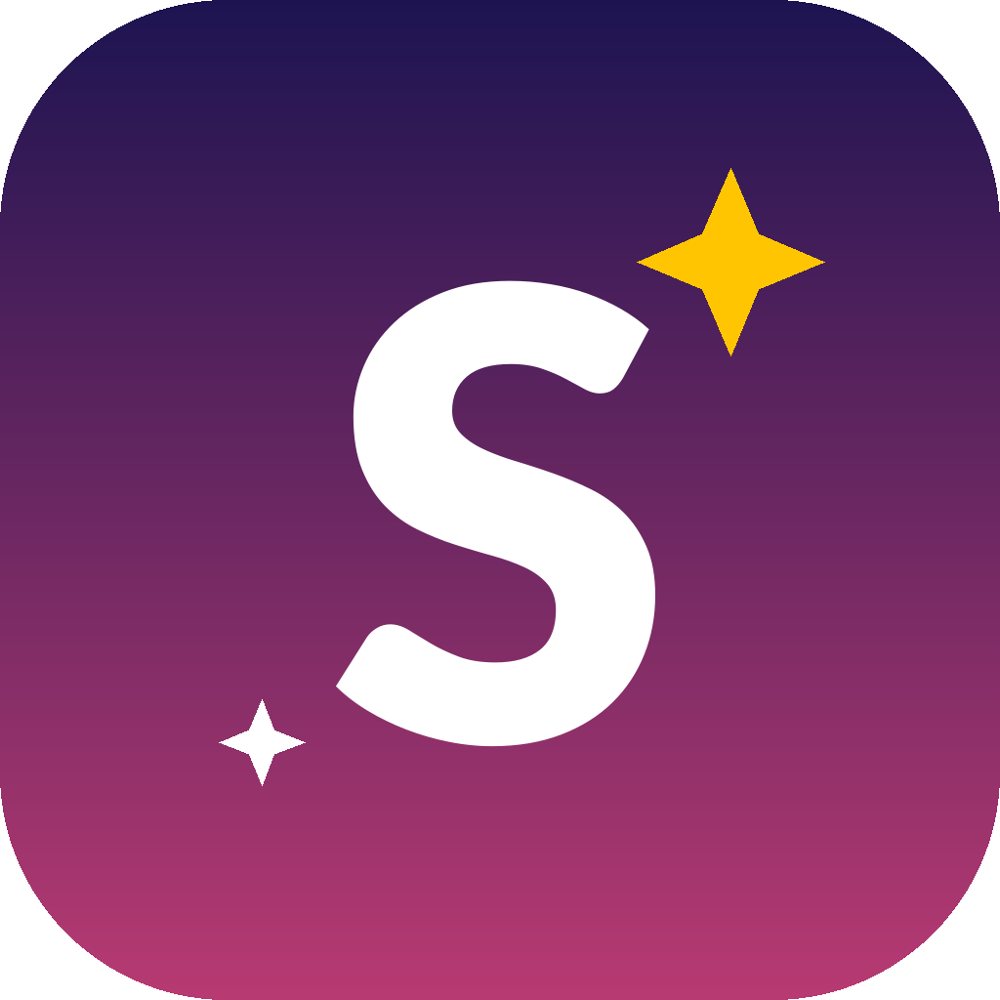

<div align="center">



# 🌟 SIAPIN — Siap Taklukkan PTN Impianmu

**Platform bimbel digital untuk persiapan SNBT, TKA SMA & TKA SMP — drill soal, ukur kesiapan, dan estimasi peluang masuk PTN impianmu.**

<br/>


**🏆 Team MW Menang - SCC · Gemastik/Inovasi Digital (Babak Penyisihan)**

| | | |
|---|---|---|
| 👨‍💻 | **Bagas Rizky Hary Saputra** | Programmer |
| 🎨 | **Amelia Galuh Widianingrum** | Desainer |
| 💡 | **Theodora Ovrisa Ersalina** | Desain & Conceptor |

🌐 **Website Live:** [https://siapin.work.gd](https://siapin.work.gd)

</div>

---

## 📑 Daftar Isi

1. [📌 Ketentuan Pengumpulan Karya](#ketentuan-pengumpulan-karya-babak-penyisihan)
2. [💭 Penjelasan Aplikasi](#penjelasan-aplikasi)
3. [🛠️ Teknologi yang Digunakan](#teknologi-yang-digunakan)
4. [✨ Fitur Utama](#fitur-utama)
5. [🏗️ Filosofi dan Arsitektur](#filosofi-dan-arsitektur)
6. [🔌 Cara Instalasi](#cara-instalasi)
7. [▶️ Cara Penggunaan](#cara-penggunaan)
8. [📂 Struktur Proyek](#struktur-proyek)
9. [📚 Sumber Data dan Kredit](#sumber-data-dan-kredit)

---

## 📌 Ketentuan Pengumpulan Karya (Babak Penyisihan)

Sesuai ketentuan lomba **“Smart Sustainable Digital Solution for Inclusive Society”**, karya ini dikumpulkan dalam bentuk:

<details>
<summary><b>1️⃣ Tautan Repositori GitHub</b> — berisi seluruh kode program aplikasi</summary>

<br/>

- Seluruh **kode sumber aplikasi** tersimpan rapi di repositori GitHub.
- Repositori ini **wajib menyertakan dokumen `README.md`** (dokumen yang sedang Anda baca ini) yang mencakup: ketentuan pengumpulan karya, penjelasan aplikasi, teknologi yang digunakan, fitur utama, cara instalasi, dan cara penggunaan.
- Setiap perubahan kode dicatat melalui **git commit** agar riwayat pengembangan jelas & transparan.

</details>

<details>
<summary><b>2️⃣ Tautan Hasil Karya yang Sudah di-Hosting</b> — aplikasi berjalan & bisa diakses publik</summary>

<br/>

- Aplikasi di-**deploy** ke hosting produksi (VPS + Nginx + HTTPS) sehingga dapat diakses secara nyata:
  - 🌐 **https://siapin.work.gd**
- Sertakan tautan ini pada formulir/berkas pengumpulan sebagai bukti karya berfungsi (**link website**).

</details>

<details>
<summary><b>3️⃣ Kesesuaian dengan Subtema Lomba</b></summary>

<br/>

Subtema lomba berfokus pada **solusi digital berbasis web yang inovatif, responsif, dan aplikatif** untuk masa depan yang **inklusif, berkelanjutan**, dan siap transformasi digital. SIAPIN mendukung tujuan tersebut melalui:

| SDG | Kontribusi SIAPIN |
|---|---|
| 🎓 **SDG 4 — Pendidikan Berkualitas** *(tema utama)* | Menyediakan akses **latihan soal & bimbingan setara bimbel** secara **gratis dan terjangkau** lewat web, sehingga siapa pun — termasuk siswa di daerah tanpa akses bimbel fisik — bisa mempersiapkan SNBT/PTN. |
| 📈 **SDG 8 — Pekerjaan Layak & Pertumbuhan Ekonomi** | Membantu siswa **lolos PTN** sehingga membuka peluang pendidikan tinggi & karier lebih baik; memberdayakan talenta digital masa depan. |
| 💻 **SDG 9 — Industri, Inovasi & Infrastruktur** | Dibangun di atas **teknologi web modern** (Next.js, React, TypeScript, Tailwind, Prisma) dengan arsitektur efisien & mudah di-deploy — contoh nyata inovasi berbasis web. |
| 🌱 **SDG 11 — Kota & Komunitas Berkelanjutan** | Solusi **ringan & ramah sumber daya** (SQLite file tunggal, tanpa server DB mahal) yang dapat dijalankan di perangkat minim — mendukung layanan publik pendidikan yang inklusif. |

> **Inklusif**: cukup browser & internet — tanpa biaya bimbel mahal.
> **Berkelanjutan**: arsitektur ringan, data lokal, mudah dirawat & dicadangkan.
> **Siap transformasi digital**: pengalaman belajar modern, gamifikasi, dan berbasis data.

</details>

---

## 💭 Penjelasan Aplikasi

### Latar Belakang

Setiap tahun, ratusan ribu siswa bersaing memperebutkan kursi di **Perguruan Tinggi Negeri (PTN)** melalui jalur SNBT. Sayangnya, tidak semua siswa punya akses yang sama:

- **Biaya bimbel konvensional mahal** dan tidak terjangkau sebagian besar keluarga.
- **Materi & latihan soal berkualitas tersebar** dan sulit ditemukan dalam satu tempat.
- Siswa **tidak tahu seberapa besar peluangnya** diterima di PTN/prodi impian sebelum mendaftar.
- **Tidak ada umpan balik** yang jelas tentang kelemahan & progres belajar.

Dari situlah **SIAPIN** lahir — sebuah platform bimbel digital yang ingin **menghapus hambatan biaya dan akses** menuju pendidikan tinggi.

### Tujuan

1. Menyediakan **bank soal orisinal & gratis** untuk SNBT, TKA SMA, dan TKA SMP dengan format yang menyerupai ujian sebenarnya.
2. Memberikan **diagnostik & estimasi peluang masuk PTN** berbasis data agar siswa bisa memilih kampus/prodi secara **cerdas dan realistis**.
3. Membangun **kebiasaan belajar** lewat gamifikasi (streak, achievement, leaderboard).
4. Menjadi solusi web yang **responsif (HP/tablet/desktop), inklusif, ringan, dan berkelanjutan**.

---

## 🛠️ Teknologi yang Digunakan

### Framework & Bahasa

| Teknologi | Versi | Kegunaan |
|---|---|---|
| ⚛️ **Next.js** | 16.3.4 | Framework React full-stack (App Router, SSR, API Routes) |
| ⚛️ **React** | 19.2.8 | Library UI berbasis komponen |
| 🟦 **TypeScript** | ^5 | Bahasa dengan type safety untuk kode yang lebih andal |
| 🎨 **Tailwind CSS** | v4 | Utility-first CSS untuk desain cepat & konsisten |
| 💾 **Prisma ORM** | 7.10.0 | ORM modern untuk akses database yang aman & terstruktur |
| 🗄️ **better-sqlite3** | 13.0.3 | Database SQLite (file tunggal, tanpa server terpisah) |
| 🔐 **Auth.js (NextAuth v5)** | ^5.0.0-beta | Autentikasi: login email + OAuth Google, sesi JWT |
| 🔒 **bcryptjs** | 3.0.3 | Hash password |

### Library Pendukung

| Library | Kegunaan |
|---|---|
| `@prisma/adapter-better-sqlite3` | Menghubungkan Prisma ke SQLite |
| `tsx` | Menjalankan script TypeScript (seed, backup) |
| `next/font/google` | Font **Plus Jakarta Sans** & **Baloo 2** (karakter ramah & modern) |
| `dotenv` | Membaca file `.env` |
| Brevo API (REST) | **Email transaksional**: verifikasi email & reset password |

### Alasan Pemilihan Teknologi

- **Next.js + App Router**: satu codebase untuk frontend *dan* backend (API route) — ringkas, cepat (SSR), dan mudah di-deploy.
- **TypeScript**: mengurangi bug, memudahkan kerja tim (kode lebih terdokumentasi).
- **SQLite + Prisma**: **tanpa server database terpisah** — cukup satu file, portabel, mudah di-backup; sangat cocok untuk solusi yang **berkelanjutan & mudah diset-up** oleh siapa pun (termasuk juri).
- **Auth.js**: standar industri untuk autentikasi, mendukung banyak provider (Google OAuth) dengan aman.
- **Tailwind v4 + CSS Variables**: sistem desain berwarna *soft* khas SIAPIN (indigo, lime, blush, lavender) yang konsisten dan ringan.

---

## ✨ Fitur Utama

> Hal yang menjadi **pembeda sekaligus keunggulan** SIAPIN dibanding aplikasi lain.

<details open>
<summary><b>📚 1. Bank Soal Orisinal 2.158 Soal — 3 Mode Ujian</b></summary>

<br/>

| Mode | Subtes/Mapel | Jumlah |
|---|---|---|
| 🎯 **SNBT** | Penalaran Matematika, PPU, PBM, Pengetahuan Kuantitatif, Literasi B. Indonesia, Literasi B. Inggris | 900 |
| 🔬 **TKA SMA** | Matematika, Fisika, Kimia, Biologi, Ekonomi | 760 |
| 📐 **TKA SMP** | Matematika, IPA, Bahasa Inggris | 498 |
| | **Total** | **2.158** |

- Seluruh soal **ditulis orisinal** (bukan disalin), mengikuti struktur resmi SNPMB SNBT & Pusmendik.
- Dilengkapi **koreksi & pembahasan** langsung setelah menjawab.
</details>

<details>
<summary><b>🎯 2. Estimasi Peluang Masuk PTN (Data 75 PTN & 3.825 Prodi)</b></summary>

<br/>

- Input nilai → dapat **estimasi peluang diterima** di PTN & prodi impian.
- Berbasis dataset **daya tampung, peminat, rasio keketatan, dan passing grade estimasi** (SNPMB + crowdsource).
- Menampilkan **logo resmi 74 PTN** dan rekomendasi prodi yang realistis.
</details>

<details>
<summary><b>📊 3. Diagnostic AI — Radar Kemampuan</b></summary>

<br/>

- Setelah mengerjakan soal, SIAPIN menyusun **diagnostik kemampuan per subtes**.
- Ditampilkan dalam **radar chart** sehingga siswa langsung tahu **materi mana yang kuat & lemah** → belajar lebih terarah.
</details>

<details>
<summary><b>🏆 4. Gamifikasi: Leaderboard, Streak & Achievement</b></summary>

<br/>

- **Leaderboard nasional real-time** dengan podium #1 #2 #3 + animasi *confetti* 🎊.
- **Streak harian** — membangun kebiasaan belajar konsisten.
- **Achievement**: *Top Performer*, *Never Give Up*, *Streak Master* — terbuka otomatis saat syarat tercapai.
</details>

<details>
<summary><b>🔐 5. Akun Modern: Google OAuth + Verifikasi Email</b></summary>

<br/>

- Daftar/login **email & password** (password di-hash bcrypt) **atau** sekali-klik **Google OAuth**.
- **Verifikasi email** & **lupa password / reset** dikirim via email transaksional **Brevo**.
- Profil pribadi: akurasi, total soal, streak, riwayat & prestasi.
</details>

<details>
<summary><b>👩‍🏫 6. Bimble & Mentor</b></summary>

<br/>

- Halaman bimbingan dengan **14 guru/mentor** (TKA SMP/SMA/SNBT).
- Setiap guru punya **halaman/panel materi** khusus — suasana bimbel sungguhan secara digital.
</details>

<details>
<summary><b>📱 7. Super Responsif — HP, Tablet, Desktop</b></summary>

<br/>

- Dioptimalkan untuk **portrait & landscape**, dan semua ukuran layar.
- Skala desain proporsional (`--pm`) — nyaman dipakai di HP dengan layar kecil.
- Transisi antar halaman yang halus & menyenangkan.
</details>

<details>
<summary><b>💾 8. Sistem Backup Otomatis Database</b></summary>

<br/>

- Backup **file SQLite + dump JSON** ke folder `backups/` (manual & bisa dijadwalkan via cron).
- Setiap backup tercatat rapi di tabel `BackupLog` — data aman & bisa direstorasi/dipindah.
</details>

---

## 🏗️ Filosofi dan Arsitektur

> *“Mudah diset-up, ringan dijalankan, mudah dirawat — supaya solusi ini benar-benar dipakai dan berkelanjutan.”*

### Kenapa Arsitekturnya Seperti Ini?

| Keputusan | Alasan |
|---|---|
| **SQLite file tunggal** (bukan PostgreSQL/MySQL) | Tanpa server DB terpisah → setup instan, portabel, hemat sumber daya, mudah backup. Cukup andal untuk skala ribuan pengguna awal. |
| **Bank soal sebagai file TypeScript statis** | Soal cepat diakses (tanpa query DB), mudah di-*review*, bisa di-versioning via git, dan tidak perlu migrasi tiap menambah soal. |
| **Repository Pattern (`lib/repo`)** | Memisahkan logika akses data dari UI → kode bersih, mudah diuji & dirawat. |
| **Next.js App Router + API Routes** | Frontend & backend dalam satu proyek — deploy sederhana (satu proses `next start`). |
| **Auth.js sesi JWT** | Autentikasi aman tanpa perlu tabel sesi tambahan; siap ditambah provider lain. |
| **CSS Variables + Tailwind + `--pm` scaling** | Satu sumber warna & skala → desain konsisten, responsif, dan mudah diubah. |
| **Data PTN terpisah (JSON + helper estimasi)** | Dataset besar tidak membebani DB; estimasi jadi *pure function* yang transparan & bisa diaudit. |

### Alur Data Singkat

```text
User (HP/Desktop)
      │  HTTPS
      ▼
Nginx (siapin.work.gd) ──► Next.js (App Router + API Routes) ──► Prisma ──► SQLite (file)
      │                              │
      │                              ├─► Bank soal statis (lib/data) — 2.158 soal
      │                              ├─► Dataset PTN (lib/data/ptn) — 75 PTN / 3.825 prodi
      │                              ├─► Brevo API — email verifikasi & reset
      │                              └─► lib/repo — repository akses data
```

---

## 🔌 Cara Instalasi

### Prasyarat

- **Node.js** 20+ (disarankan 22.x LTS)
- **npm** 10+
- (Opsional) Akun [Brevo](https://www.brevo.com) untuk email sungguhan — bisa **dilewati** (mode simulasi)

### Langkah-langkah

<details open>
<summary><b>1️⃣ Clone repositori</b></summary>

```bash
git clone git@github.com:bagasrizkyharysaputra/siapin.git
cd siapin
```

</details>

<details open>
<summary><b>2️⃣ Install dependensi</b></summary>

```bash
npm install --legacy-peer-deps
```

> ⚠️ **Wajib** memakai `--legacy-peer-deps` (menghindari bug resolusi peer dependency `edgesOut`).

</details>

<details open>
<summary><b>3️⃣ Siapkan environment variable</b></summary>

Buat file `.env` di root proyek. Contoh isi minimal:

```env
# URL aplikasi
NEXTAUTH_URL=http://localhost:3000
AUTH_URL=http://localhost:3000
AUTH_SECRET=<generate-acak-panjang>

# Database SQLite (file lokal)
DATABASE_URL="file:./prisma/dev.db"

# Opsional — Google OAuth (kosongkan untuk nonaktif)
GOOGLE_CLIENT_ID=
GOOGLE_CLIENT_SECRET=

# Opsional — Email transaksional via Brevo (kosongkan = mode simulasi)
RESEND_API_KEY=
EMAIL_FROM="SIAPIN <email-pengirim@example.com>"
```

Generate secret: `openssl rand -base64 32`

> Tanpa `GOOGLE_CLIENT_ID/SECRET`, login Google otomatis disembunyikan.
> Tanpa `RESEND_API_KEY`, email verifikasi/reset berjalan **mode simulasi** (link ditampilkan di layar, tidak dikirim).

</details>

<details open>
<summary><b>4️⃣ Siapkan database & seed (opsional)</b></summary>

```bash
# Jalankan migrasi database SQLite
npx prisma migrate deploy

# Seed data awal + akun demo (disarankan)
npm run db:seed
```

Akun demo yang dibuat seed: **`contoh@gmail.com` / `contoh123`**

</details>

<details open>
<summary><b>5️⃣ Jalankan mode pengembangan</b></summary>

```bash
npm run dev
```

Buka **http://localhost:3000**

</details>

---

## ▶️ Cara Penggunaan

### Menjalankan aplikasi

```bash
# Mode pengembangan (development) — hot reload
npm run dev

# Mode produksi
npm run build
npm run start
```

Aplikasi berjalan di `http://localhost:3000` (default).

### Alur pakai aplikasi

1. **Buka** http://localhost:3000 → otomatis diarahkan ke **Dashboard**.
2. **Daftar/Login** — pakai akun demo `contoh@gmail.com` / `contoh123`, atau daftar baru (email + password / Google).
3. Pilih **mode ujian** di dashboard: **SNBT**, **TKA SMA**, atau **TKA SMP**.
4. **Kerjakan soal** → dapat koreksi + pembahasan instan.
5. Lihat **Diagnostic AI / radar chart** untuk mengetahui subtes yang perlu diperkuat.
6. Gunakan **“Input Nilai / Pilih PTN”** untuk melihat **estimasi peluang masuk PTN** impian.
7. Jaga **streak harian**, kumpulkan **achievement**, dan lihat posisimu di **Leaderboard** 🏆.

### Script & perintah berguna

```bash
npm run dev          # Jalankan development server
npm run build        # Build produksi (Next.js)
npm run start        # Jalankan server produksi
npm run lint         # Cek kode dengan ESLint
npm run db:seed      # Seed database + akun demo
npm run db:backup    # Backup database (SQLite copy + JSON dump) ke /backups
npm run db:studio    # Buka Prisma Studio (GUI database)
npx prisma migrate deploy   # Terapkan migrasi database
npx prisma migrate dev      # Buat migrasi baru saat mengubah schema
```

### Deploy produksi (contoh — VPS + Nginx)

```bash
npm run build
nohup ./node_modules/.bin/next start -p 8080 >> /tmp/siapin.log 2>&1 &
```

Lalu arahkan Nginx ke `127.0.0.1:8080` dengan sertifikat HTTPS (contoh: Let's Encrypt).

---

## 📂 Struktur Proyek

```text
siapin/
├─ app/                        # Next.js App Router (halaman & API)
│  ├─ page.tsx                 # Landing → redirect ke /dashboard
│  ├─ dashboard/page.tsx       # Dashboard utama
│  ├─ soal/[slug]/...          # Halaman latihan soal (mode/subtes/paket)
│  ├─ bimble/page.tsx          # Bimbingan belajar (guru/mentor)
│  ├─ leaderboard/page.tsx     # Papan peringkat
│  ├─ profile/page.tsx         # Profil & pengaturan
│  └─ api/                     # API routes (auth, soal, diagnostik, dll.)
├─ components/
│  ├─ layout/                  # Layout, transisi halaman, navbar
│  ├─ ui/                      # Komponen UI dasar
│  └─ features/                # Komponen per fitur
│     ├─ dashboard/  ├─ soal/  ├─ bimble/
│     ├─ leaderboard/          # Podium, confetti, baris peringkat
│     └─ profile/              # Kartu akun, achievement, popup edit
├─ lib/
│  ├─ repo/                    # Repository pattern (akses data)
│  ├─ data/                    # Data statis: modes, bank soal, PTN, guru
│  │  ├─ bank/banks/           # 2.158 soal orisinal (snbt, tka-sma, tka-smp)
│  │  └─ ptn/                  # 75 PTN, 3.825 prodi, estimasi, logo
│  ├─ store/                   # State (auth)
│  ├─ auth.ts                  # Konfigurasi Auth.js
│  ├─ mail.ts                  # Email transaksional (Brevo) + token
│  ├─ db.ts                    # Koneksi Prisma
│  ├─ backup.ts                # Sistem backup database
│  └─ cq.ts                    # Utility container-query & skala responsif
├─ prisma/
│  ├─ schema.prisma            # Skema database (User, Soal, Riwayat, dst.)
│  ├─ migrations/              # Migrasi database
│  └─ seed.ts                  # Seed awal + akun demo
├─ public/
│  ├─ visual/                  # Logo, maskot, aset visual
│  └─ logos/                   # Logo 74 PTN
└─ package.json
```

### Model Data (ringkas)

```text
User ── UserProfile          (profil: nama, no. HP, avatar)
 ├── AiDiagnostic            (hasil diagnostik per subtes)
 ├── InputNilai              (nilai untuk estimasi PTN)
 ├── RiwayatPengerjaan       (riwayat latihan)
 │     └── JawabanUser       (jawaban detail)
 ├── Leaderboard             (skor per mode)
 ├── UserAchievement ── Achievement
Mapel ── PaketSoal ── Soal   (bank soal)
Guru                          (mentor/bimble)
BackupLog                     (log backup database)
```

---

## 📚 Sumber Data dan Kredit

<details>
<summary><b>Bank Soal — 2.158 soal orisinal</b></summary>

<br/>

Seluruh soal **ditulis orisinal** oleh tim (dengan bantuan AI generatif untuk draf awal, lalu **diverifikasi kebenaran jawaban & sintaks** sebelum dipakai). Struktur materi mengacu pada:

- Struktur resmi **SNBT** — SNPMB BPPP Kemdikbud: https://snpmb.bppp.kemdikbud.go.id
- Struktur **TKA Pusmendik/Pusmenjar**

</details>

<details>
<summary><b>Data PTN, Prodi, Daya Tampung & Passing Grade</b></summary>

<br/>

| Data | Cakupan | Sumber |
|---|---|---|
| Daftar 75 PTN (kode, wilayah, tier, daya tampung, peminat) | 75 PTN | [TeguhEP/LolosKampus](https://github.com/TeguhEP/LolosKampus) |
| 3.825 prodi (daya tampung 2026, peminat, rasio keketatan, passing grade estimasi) | 75 PTN × 3.825 prodi | [TeguhEP/LolosKampus](https://github.com/TeguhEP/LolosKampus) |
| Data historis daya tampung & peminat (2021–2025) | 543 prodi | [divarvian/daya-tampung](https://github.com/divarvian/daya-tampung) |

Sumber asli yang dirujuk: **SNPMB SNBT 2021–2026** (data resmi) & **Schoolfess Community 2022–2025** (crowdsource nilai UTBK untuk rekonstruksi passing grade estimasi).

> ⚠️ Passing grade adalah **estimasi** (rekonstruksi dari data crowdsource), bukan ambang resmi SNPMB.

**Logo PTN**: diunduh dari **Wikipedia Bahasa Indonesia / Wikimedia Commons** (74 dari 75 PTN; sisanya fallback ke inisial).

</details>

---

<div align="center">
  
  <br/><br/>
  <b>SIAPIN — Siap Taklukkan PTN Impianmu</b><br/>
  Dibuat dengan ❤️ oleh <b>Team MW Menang - SCC</b>
  <br/><br/>
  <sub>© 2026 · https://siapin.work.gd · Repo: github.com/bagasrizkyharysaputra/siapin</sub>
</div>
